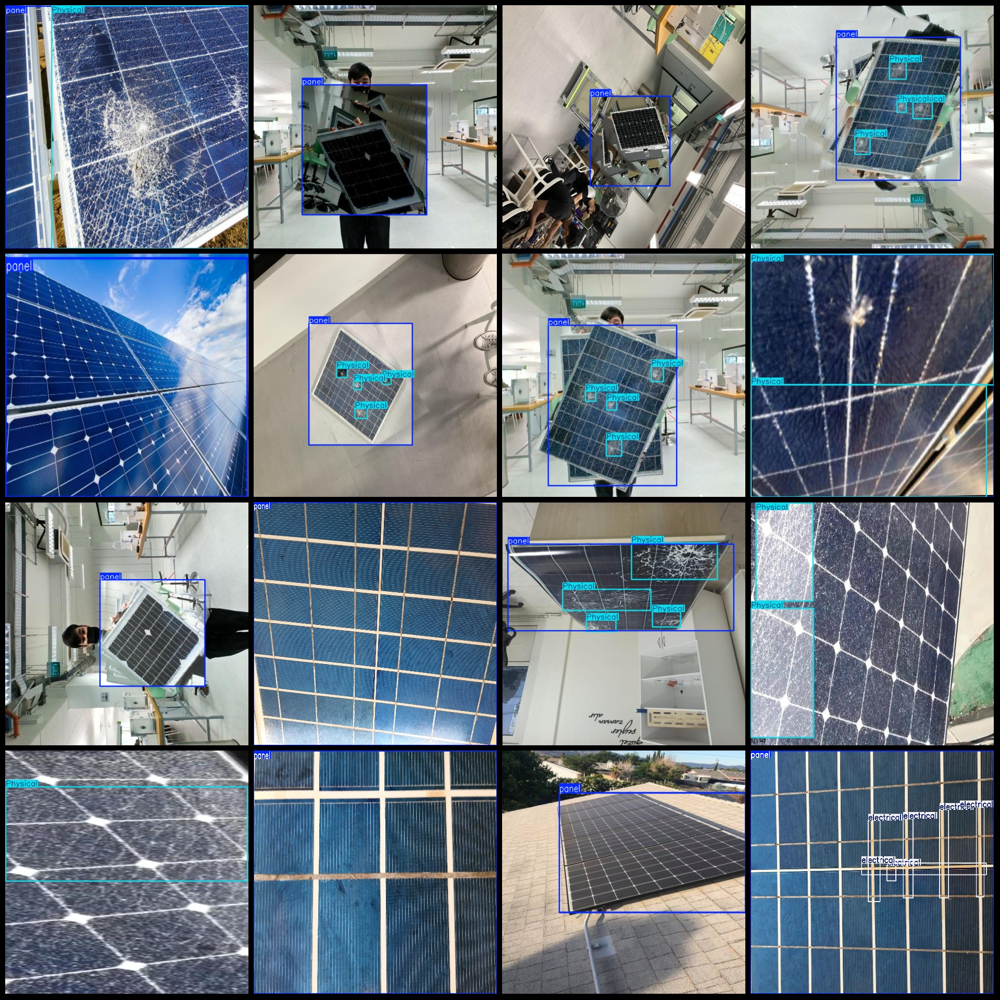
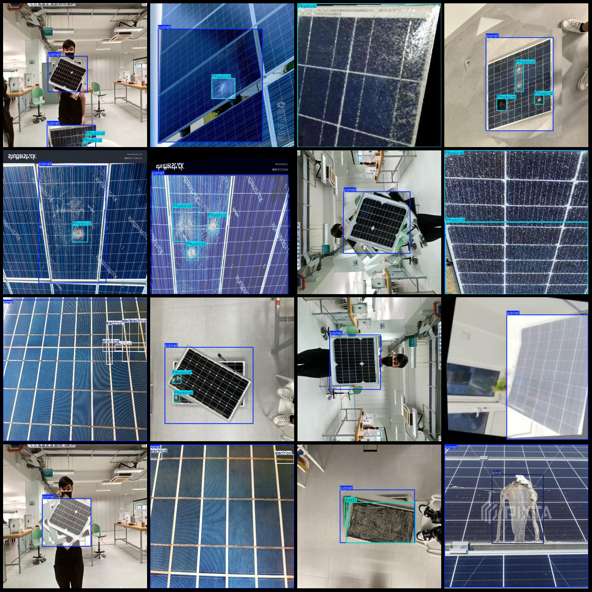

# Photovoltaic Panel Defect Detection Dataset VOC+YOLO Format, 9475 Images in 7 Categories

Dataset format: Pascal VOC format + YOLO format (txt file without split path, only containing jpg images and corresponding VOC format xml files and yolo format txt files)
Number of images (jpg file count): 9475
Number of annotations (xml file count): 9475
Number of annotations (txt file count): 9475
Number of annotation categories: 7
Annotation category names (notice that the order of categories in the yolo format does not correspond to this, but is based on the labels folder classes.txt): ["Physical", "bird", "dust", "electrical", "leaf", "panel", "snow"]
Number of bounding boxes for each category:
- Physical (physical damage) = 9307
- bird (bird droppings) = 2273
- dust (dust accumulation) = 4241
- electrical (electrical fault) = 1500
- leaf (fallen leaves) = 1141
- panel (photovoltaic panel) = 9545
- snow (snow accumulation) = 1110
Total bounding boxes = 29117
Image resolution: 640x640
Annotation tool used: labelImg
Annotation rules: Draw a rectangle around the category
Important note: No specific mention provided
Image preview:

## Image

Here is a pay link on Stripe ( https://buy.stripe.com/3cs8yP7sY87d0vu9AB ). Please contact me lonlonago@foxmail.com after funding $89, and I will send you a complete data files , thank you!

